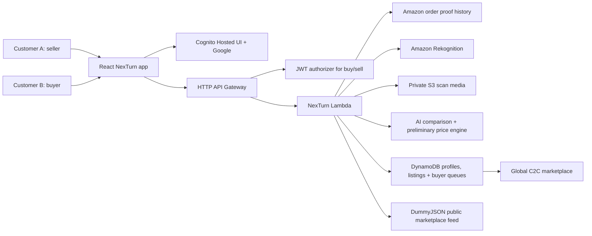

# NexTurn

NexTurn is a direct Customer-to-Customer second-life commerce prototype for
returned and underused products. The core product rule is simple: no warehouse
touches the item. The seller keeps the product at home until a buyer joins the
queue and pickup verification unlocks payment; Amazon facilitates local pickup,
quality check, and delivery.

## Customer Problem

Customers lose value when usable items are returned, discarded, or pushed into
opaque liquidation channels. Buyers also hesitate to trust second-hand products
because condition and authenticity are unclear. NexTurn solves this from both
sides of one unified account:

- sellers list real products from verified order history;
- buyers inspect order proof, preliminary AI comparison, purchase date, seller
  location, and estimated delivery fee before joining the buyer queue;
- Amazon acts as the trust and logistics layer, not as a warehouse middle step.

## Implemented Prototype

- Unified Buyer + Seller account shell with Cognito Hosted UI and optional Google
  sign-in.
- Sell / Return Items hub gated behind login.
- Amazon order proof history with 5 high-value products, original
  price, purchase date, ASIN, original product image, and proof metadata.
- Real upload flow for seller item photos.
- AWS Rekognition image evidence on deployed API, combined with deterministic
  photo comparison for product identity, order-photo similarity, dominant
  colour/variant, and visible damage risk.
- Damage-aware grading: cracked or broken screen evidence forces low grades like
  `C`, and variant or colour mismatches cannot receive an `A`.
- Dynamic preliminary resale value based on the AI comparison result.
- Address-gated accounts: every signed-in account must save an India delivery
  address before listing an item or joining a buyer queue.
- Global C2C marketplace that merges NexTurn AI-graded listings with 100+ public
  API background products from DummyJSON.
- Listing detail drawer with transparent order proof, purchase date, AI
  comparison result, preliminary price, delivery estimate, and "AI Graded &
  Amazon Verified" badge.
- Buyer queue flow: buyers express interest, payment remains locked, and the
  final value is confirmed only after manual pickup inspection.
- DynamoDB persistence for customer profiles, created listings, and buyer queue
  interest records.
- S3 media persistence and Rekognition permissions in the AWS CDK stack.

## Architecture



## Main Flow

1. Seller signs in.
2. Seller saves an India delivery address in Profile.
3. Seller opens Sell / Return Items and selects a product from Amazon order
   history.
4. Seller uploads a real item photo.
5. Backend compares the upload against the order proof photo, metadata, and
   expected colour/variant, then calculates a preliminary grade and resale value.
6. Seller publishes the listing. The item stays with the seller at home.
7. Another signed-in buyer saves an India delivery address, opens Marketplace,
   and sees the listing above the public API product feed.
8. Buyer opens the listing, checks order proof, original purchase date,
   preliminary AI comparison, price, seller location, and estimated delivery fee.
9. Buyer joins the buyer queue. Payment stays locked until an Amazon delivery
   partner verifies the item at pickup and opens the final payment step.

## Local Development

```bash
npm install
npm run dev
```

Open `http://127.0.0.1:5173/`.

Local mode can render the app and marketplace. Authenticated buy/sell flows are
fully available on the deployed AWS URL because Cognito provides real JWTs.

## Verification

```bash
npm run test
npm run smoke:api
npm run build
npm run cdk:synth
```

## AWS Deployment

The CDK stack targets `us-east-1` by default and uses Free Tier friendly
services: HTTP API, Lambda, DynamoDB on-demand, S3, Cognito, and Rekognition.

```bash
npm run cdk:synth
npm run cdk:deploy
```

Google sign-in is configuration-gated. Set `GOOGLE_CLIENT_ID` and
`GOOGLE_CLIENT_SECRET` before deploy to keep Google federation enabled.

## Key Files

- `src/App.jsx` - C2C buyer/seller web app.
- `src/data/c2cCommerce.js` - order proof history, demo accounts, seed listings,
  and supported India delivery locations.
- `src/lib/c2cCommerce.js` - product comparison, grading, pricing, address,
  delivery, listing, and buyer queue rules.
- `backend/lambda/returnResolution.js` - Lambda-compatible API handler.
- `backend/lib/aiImageAnalysis.js` - S3 upload and Amazon Rekognition analysis.
- `backend/lib/dynamodbRepository.js` - DynamoDB persistence adapter.
- `infra/cdk/app.mjs` - AWS infrastructure.
