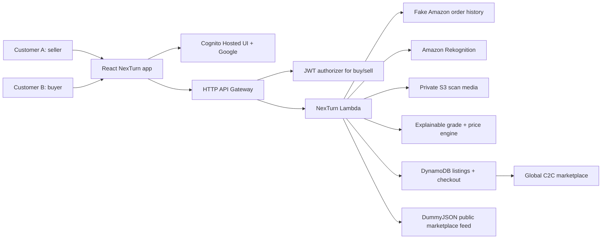

# NexTurn

NexTurn is a direct Customer-to-Customer second-life commerce prototype for
returned and underused products. The core product rule is simple: no warehouse
touches the item. The seller keeps the product at home until a buyer purchases
it, then Amazon facilitates local pickup, quality check, and delivery.

## Customer Problem

Customers lose value when usable items are returned, discarded, or pushed into
opaque liquidation channels. Buyers also hesitate to trust second-hand products
because condition and authenticity are unclear. NexTurn solves this from both
sides of one unified account:

- sellers list real products from verified order history;
- buyers inspect proof, AI evidence, scorecard, and delivery fee split;
- Amazon acts as the trust and logistics layer, not as a warehouse middle step.

## Implemented Prototype

- Unified Buyer + Seller account shell with Cognito Hosted UI and optional Google
  sign-in.
- Sell / Return Items hub gated behind login.
- Hardcoded fake Amazon order history with 5 high-value products, original
  price, purchase date, ASIN, original product image, and proof metadata.
- Real upload flow for seller item photos.
- AWS Rekognition image evidence on deployed API, combined with deterministic
  condition scoring for functional, cosmetic, packaging, accessory, and identity
  signals.
- Damage-aware grading: cracked or broken screen evidence forces low grades like
  `C` instead of pretending every upload is `A`.
- Dynamic discounted resale price based on grade.
- Global C2C marketplace that merges NexTurn AI-graded listings with 100+ public
  API background products from DummyJSON.
- Listing detail drawer with transparent scorecard, original order proof,
  discounted price, and "AI Graded & Amazon Verified" badge.
- Mock checkout: buyer pays item price plus flat Amazon Delivery Fee. The item
  payment is assigned to the seller; Amazon only facilitates local delivery.
- DynamoDB persistence for created listings and checkout receipts.
- S3 media persistence and Rekognition permissions in the AWS CDK stack.

## Architecture



## Main Flow

1. Seller signs in.
2. Seller opens Sell / Return Items and selects a product from fake Amazon order
   history.
3. Seller uploads a real item photo and chooses the visible condition preset.
4. Backend runs AWS AI evidence when deployed and the scorecard calculates grade
   and discounted resale price.
5. Seller publishes the listing. The item stays with the seller at home.
6. Another signed-in buyer opens Marketplace and sees the listing above the
   public API product feed.
7. Buyer opens the listing, checks order proof, scorecard, price, and delivery
   split.
8. Buyer clicks Buy now. Payment is simulated, checkout receipt is persisted, and
   pickup is scheduled from the seller home.

## Local Development

```bash
npm install
npm run dev
```

Open `http://127.0.0.1:5173/`.

Local mode can render the app and marketplace. Authenticated buy/sell flows are
fully available on the deployed AWS URL because Cognito provides real JWTs.

## Verification

```bash
npm run test
npm run smoke:api
npm run build
npm run cdk:synth
```

## AWS Deployment

The CDK stack targets `us-east-1` by default and uses Free Tier friendly
services: HTTP API, Lambda, DynamoDB on-demand, S3, Cognito, and Rekognition.

```bash
npm run cdk:synth
npm run cdk:deploy
```

Google sign-in is configuration-gated. Set `GOOGLE_CLIENT_ID` and
`GOOGLE_CLIENT_SECRET` before deploy to keep Google federation enabled.

## Key Files

- `src/App.jsx` - C2C buyer/seller web app.
- `src/data/c2cCommerce.js` - fake order history, demo accounts, seed listings,
  and condition presets.
- `src/lib/c2cCommerce.js` - scorecard, grade, pricing, listing, and checkout
  rules.
- `backend/lambda/returnResolution.js` - Lambda-compatible API handler.
- `backend/lib/aiImageAnalysis.js` - S3 upload and Amazon Rekognition analysis.
- `backend/lib/dynamodbRepository.js` - DynamoDB persistence adapter.
- `infra/cdk/app.mjs` - AWS infrastructure.
