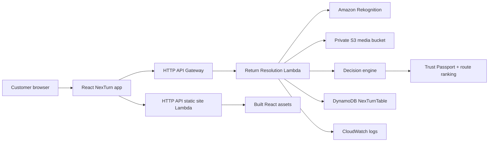

# NexTurn

NexTurn is an AI-assisted return resolution and second-life commerce prototype.
It helps a customer decide what to do with a returned item: resell, exchange,
donate, or recycle. The app makes the decision explainable with scan signals,
condition grading, buyer demand, green credits, and a trust passport.

## Why This Matters

Online returns are expensive and opaque for customers. A shopper often knows only
whether they can return an item, not what happens next or which path gives the
best value. NexTurn turns the return moment into a guided customer decision:

- get a trusted condition grade from scan signals;
- compare payout, convenience, green credits, and impact;
- match the item to second-life buyers or refurbished alternatives;
- generate a Trust Passport that makes resale more credible.

## Implemented Prototype

- Return Resolution Studio UI built with React + Vite.
- Deterministic decision engine for grade, route ranking, and green-credit logic.
- Real upload flow: customer return photos are sent to the backend, stored in S3,
  analyzed with Amazon Rekognition `DetectLabels`, and surfaced as AI evidence.
- AI transparency view that explains there is no rushed custom-trained model; AWS
  AI provides visual signals and the final customer decision remains explainable.
- Lambda-compatible API with endpoints for case fetch, workspace pages, scan
  evaluation, and route selection.
- DynamoDB persistence path for scan evaluations, route decisions, trust passport
  updates, and credit ledger events.
- AWS CDK stack for DynamoDB, Lambda, HTTP API Gateway, private S3 media storage,
  Rekognition permissions, and CloudWatch logs.
- Generated product and profile assets for a realistic demo surface.

## Architecture



## Local Development

```bash
npm install
npm run dev
```

Open `http://127.0.0.1:5173/`.

## Live AWS Demo

https://l5f3ovamaj.execute-api.us-east-1.amazonaws.com

## Verification

```bash
npm run build
npm run smoke:api
npm run cdk:synth
```

## AWS Deployment

The CDK stack targets `us-east-1` by default.

```bash
npm run cdk:synth
npm run cdk:deploy
```

The stack uses pay-per-request DynamoDB and a small ARM Lambda to stay
free-tier-friendly for prototype traffic. The deployed stack outputs the live
site/API URL, DynamoDB table name, and backing S3 bucket name for uploaded scan
media.

## Key Files

- `src/lib/decisionEngine.js` - grading, route ranking, and impact logic.
- `src/data/returnCase.js` - realistic seeded return scenario.
- `backend/lambda/returnResolution.js` - Lambda-compatible API handler.
- `backend/lib/aiImageAnalysis.js` - S3 upload and Amazon Rekognition analysis.
- `backend/lib/dynamodbRepository.js` - DynamoDB persistence adapter.
- `infra/cdk/app.mjs` - AWS CDK stack.
- `docs/architecture/` - DynamoDB model and access patterns.
- `docs/architecture/ai-model-strategy.md` - current AI approach and training
  plan.
- `docs/design/return-resolution-studio-concept.png` - selected visual concept.
