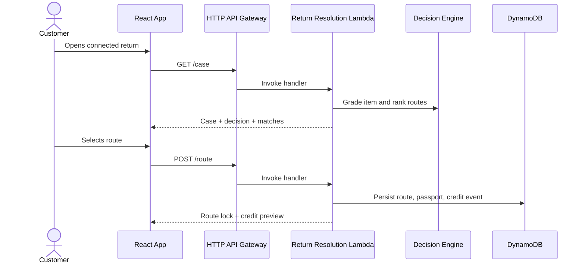

# System Architecture

## Runtime Flow

## AWS Services

| Service | Use | Why it fits |
| --- | --- | --- |
| DynamoDB | Return cases, scans, route decisions, passports, credit events | Low-latency serverless data model with on-demand capacity |
| Lambda | Decision API | Small event-driven workload, free-tier-friendly |
| HTTP API Gateway | API surface | Cheaper and simpler than REST API for prototype routes |
| S3 | Static build artifact target and future media storage | Durable, low-cost object storage |
| CloudWatch | Logs and metrics | Built-in operational visibility |

## Customer-Centric Decision Model

NexTurn does not simply maximize resale revenue. It compares:

- customer payout;
- time to resolution;
- convenience;
- item condition and confidence;
- second-life demand;
- green credits and sustainability impact.

For the seeded scenario, resale wins because the item has high condition,
complete accessories, strong demand, and a trusted buyer match.
